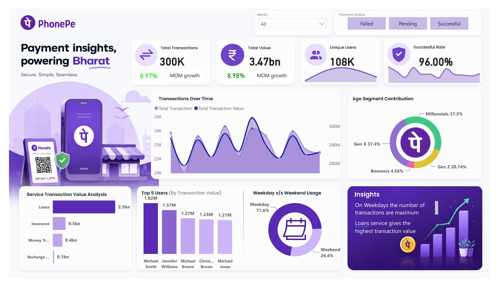

📊 PhonePe Transaction Analysis Dashboard | Power BI

📌 Project Overview

The PhonePe Transaction Analysis Dashboard is an interactive Business Intelligence solution developed using Power BI to analyze digital payment transactions and uncover meaningful insights from large-scale transaction data. The dashboard provides a comprehensive view of transaction performance, user behavior, service utilization, and payment trends through visually appealing and interactive reports.

This project demonstrates the ability to transform raw data into actionable insights using data modeling, DAX calculations, and interactive visualizations.

🎯 Objectives
Analyze transaction volume and transaction value trends.
Monitor key business performance indicators (KPIs).
Understand customer demographics and usage patterns.
Identify high-performing services and user segments.
Provide interactive, data-driven insights for better decision-making.

📈 Dashboard Highlights
📈 300K+ Transactions analyzed
💰 ₹3.47 Billion total transaction value
👥 108K Unique Users
✅ 96% Successful Transaction Rate
📊 Transaction trends and growth analysis
📅 Weekday vs Weekend usage patterns
🏦 Service-wise transaction performance analysis
🎯 Interactive filters and dynamic KPIs

📊 Dashboard Features
🔹 Key Performance Indicators (KPIs)
Total Transactions: 300K+
Total Transaction Value: ₹3.47 Billion
Unique Users: 108K
Successful Transaction Rate: 96%
Month-over-Month (MoM) Growth Analysis

🔹 Interactive Visualizations
Transaction Trends Over Time
Service-wise Transaction Value Analysis
Age Segment Contribution Analysis
Top Users by Transaction Value
Weekday vs Weekend Usage Analysis
Dynamic Slicers and Filters

🔹 Business Insights
Customer behavior and payment patterns
Service performance comparison
User demographic analysis
Transaction growth and performance monitoring

🛠️ Tools & Technologies Used
Power BI Desktop
Power Query
DAX (Data Analysis Expressions)
Data Modeling
Data Cleaning & Transformation
Interactive Data Visualization

📂 Dataset Information

The dashboard is built using transaction and user datasets containing:

Transaction details
Payment values
User demographics
Service categories
Date and time information

🚀 Skills Demonstrated

Business Intelligence Reporting
Data Analytics
Dashboard Design
Data Storytelling
KPI Development
Data Modeling and Transformation
Analytical Thinking and Problem Solving

🎯 Project Outcome

This project showcases my ability to build end-to-end interactive dashboards, perform data analysis, and present insights through effective data storytelling. It highlights my proficiency in Power BI, DAX, data modeling, and business intelligence reporting.

⭐ Feel free to explore the dashboard and share your feedback!

🏷️ Tags

Power BI | Data Analytics | Business Intelligence Dashboard | Data Visualization | DAX Power Query | PhonePe Portfolio Project | Data Analyst
